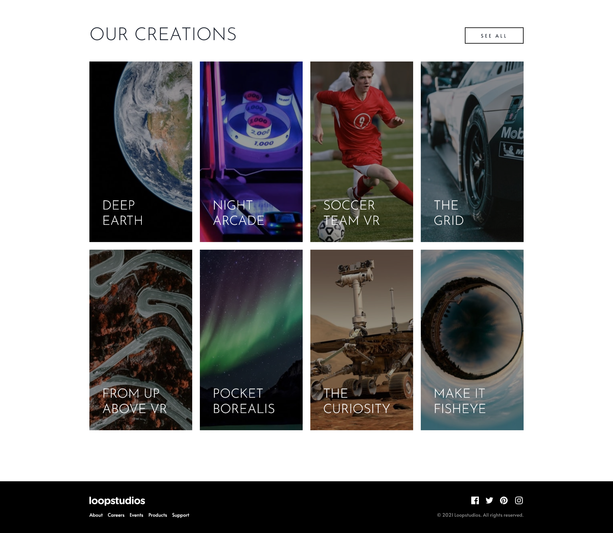
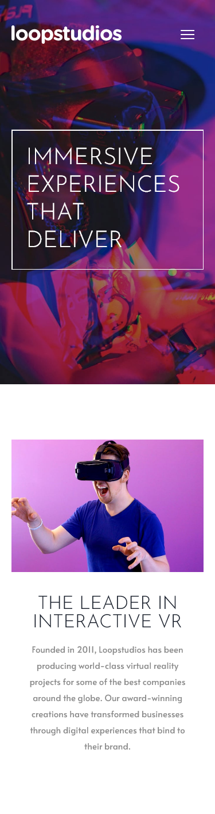
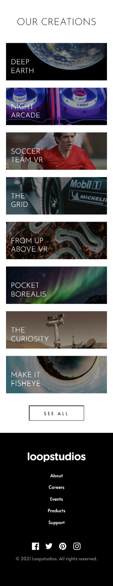

# Frontend Mentor - Loopstudios landing page solution

This is a solution to the [Loopstudios landing page challenge on Frontend Mentor](https://www.frontendmentor.io/challenges/loopstudios-landing-page-N88J5Onjw). Frontend Mentor challenges help you improve your coding skills by building realistic projects. 

## Table of contents

- [Frontend Mentor - Loopstudios landing page solution](#frontend-mentor---loopstudios-landing-page-solution)
  - [Table of contents](#table-of-contents)
  - [Overview](#overview)
    - [The challenge](#the-challenge)
    - [Screenshot](#screenshot)
    - [Links](#links)
  - [My process](#my-process)
    - [Built with](#built-with)
    - [What I learned](#what-i-learned)
    - [Useful resources](#useful-resources)
  - [Author](#author)
  - [Acknowledgments](#acknowledgments)

**Note: Delete this note and update the table of contents based on what sections you keep.**

## Overview

### The challenge

Users should be able to:

- View the optimal layout for the site depending on their device's screen size
- See hover states for all interactive elements on the page

### Screenshot

**Desktop**


 


**Mobile**

<table>
  <tr>
    <td></td>
    <td></td>
  </tr>
 </table>

### Links

- Solution URL: [Github](https://github.com/gylim0604/FrontEnd-Mentor-Loopstudio-Landing-Page)
- Live Site URL: [Verce;](https://front-end-mentor-loopstudio-landing-page.vercel.app/)

## My process

### Built with

- [Next.js](https://nextjs.org/) - React framework
- [Chakra-UI](https://chakra-ui.com/) - React component library
- [Formik](https://formik.org/) - React form library
- Mobile-first workflow
- Flexbox
- CSS Grid


### What I learned

Once again using Next.js and Chakra UI. Feels like I'm getting better at structuring and building sites with this combination. 

Learnt more about how to customize the default styles in Chakra UI. Learnt how to change the change the default sizes with extendTheme for specific compontents, in my case the container component. 

```
 sizes: {
        container: {
            sm: '640px',
            md: '1000px',
            lg: '1400px',
            // xl: '1280px',
        },
    },
```

Also figured out how to maintain the aspect ratio of divs which was useful for my gallery component when all the images have the same width. It essentially came down to calculating the image ratio, then setting the div height to 0 and the padding to whatever the ratio is.  

```css
div{
    background-image: url(/images/mobile/image-pocket-borealis.jpg);
    padding-top: 36.69%;
    overflow: hidden;
}
```

### Useful resources

- [CSS Tricks](https://css-tricks.com/aspect-ratio-boxes/) - This article helped me figure out how to have my images maintain their aspect ration without a fixed width and height.
- [Kevin Powell](https://www.youtube.com/watch?v=ceNMP-aQkQ4&t=279s) - This video helped me with some of the transitions I used for the active states. 


## Author

- Frontend Mentor - [@gylim0604](https://www.frontendmentor.io/profile/gylim0604)
  
## Acknowledgments
